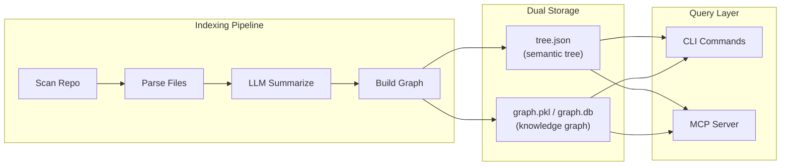

<div align="center">
 
# Repolect
 
**Semantic code intelligence powered by LLM reasoning.**
 
Index any codebase into a hierarchical semantic tree + knowledge graph.
Ask questions, trace execution flows, plan changes, analyze impact — all local-first, no vector database needed.
 
[](https://www.python.org/downloads/)
[](LICENSE)
[](pyproject.toml)
[](#mcp-server-integration)
 
</div>
 
---
 
## How It Works
 
Repolect builds a hierarchical tree of your codebase where every node — module, file, class, function — gets an LLM-generated summary. Queries navigate this tree using LLM reasoning, finding relevant code in **O(log N)** steps without any vector similarity search.
 
```
RepoNode: "E-commerce backend in Python/FastAPI..."
├── ModuleNode src/auth: "JWT-based authentication layer..."
│   ├── FileNode jwt.py: "Token generation and validation..."
│   │   ├── ClassNode JWTService: "Manages token lifecycle..."
│   │   └── FunctionNode verify_token: "Validates Bearer tokens..."
│   └── DocNode README.md: "Auth module documentation..."
└── ModuleNode src/payments: "Stripe payment processing..."
```
 
A **knowledge graph** runs alongside the tree, storing structural relations (`CALLS`, `IMPORTS`, `EXTENDS`, `IMPLEMENTS`) that power dependency analysis, impact tracing, and execution flow tracking.
 
### Architecture
 

 
---
 
## Quick Start
 
### Install from PyPI
 
```bash
pip install repolect[all]
```
 
### Install from source
 
```bash
git clone https://github.com/Bibyutatsu/Repolect.git
cd Repolect
pip install -e ".[all]"
```
 
### Index and query
 
```bash
cd your-project/
repolect analyze          # Index the codebase
repolect ask "how does authentication work?"
```
 
> **Requires an LLM provider.** Repolect defaults to [Ollama](https://ollama.com) (local, free, private). See [Configuration](#configuration) for other providers.
 
---
 
## CLI Reference
 
| Command | Description | Key Flags |
|---|---|---|
| `repolect analyze` | Full index: semantic tree + knowledge graph + agent skills | `--force`, `--all-branches`, `--skills`, `--graph-backend`, `--parse-workers`, `--num-workers`, `--no-git`, `--quiet` |
| `repolect sync` | Incremental re-index (changed files only) | `--parse-workers`, `--num-workers`, `--quiet`, `--no-cache` |
| `repolect ask "query"` | Natural-language Q&A with citations | `--max-results`, `--quiet` |
| `repolect why <path>` | Explain why a file or symbol exists | `--repo` |
| `repolect tree` | Print the semantic tree | `--depth` (default 3) |
| `repolect graph "MATCH ..."` | Run Cypher queries on the knowledge graph | `--repo` |
| `repolect impact <symbol>` | Blast radius analysis | `--max-hops` (default 3) |
| `repolect diff` | Map git changes to affected symbols | `--ref` (default HEAD~1), `--with-impact` |
| `repolect communities` | Show functional clusters (Louvain) | `--repo` |
| `repolect list` | List all indexed repositories | — |
| `repolect mcp` | Start MCP server for AI editors | — |
| `repolect viz` | Launch Streamlit graph explorer | `--port` (default 8501) |
 
---
 
## MCP Server Integration
 
The [Model Context Protocol (MCP)](https://modelcontextprotocol.io/) lets AI editors use Repolect as a live code intelligence backend.
 
```bash
repolect mcp   # Start MCP server (stdio transport)
```
 
<details>
<summary><b>Cursor</b> — add to <code>~/.cursor/mcp.json</code></summary>
 
```json
{
  "mcpServers": {
    "repolect": {
      "command": "repolect",
      "args": ["mcp"],
      "env": {
        "REPOLECT_REPO": "/path/to/your/project"
      }
    }
  }
}
```
 
</details>
 
<details>
<summary><b>Claude Code</b></summary>
 
```bash
claude mcp add repolect -- repolect mcp
```
 
</details>
 
<details>
<summary><b>Windsurf / Other MCP clients</b></summary>
 
```json
{
  "mcpServers": {
    "repolect": {
      "command": "repolect",
      "args": ["mcp"]
    }
  }
}
```
 
</details>
 
### MCP Tools
 
14 tools exposed via MCP:
 
| Tool | What It Does |
|---|---|
| `tree_search` | Semantic search — answers "how does X work?" using LLM tree reasoning |
| `get_node` | 360-degree symbol view: source code, callers, callees, relations |
| `explain_node` | LLM-powered explanation of why a symbol exists in the codebase |
| `trace_flow` | Follow CALLS edges from an entry point to build an execution flow |
| `graph_query` | Run raw Cypher queries against the knowledge graph |
| `impact_analysis` | Blast radius: what breaks if you change a given symbol |
| `diff_analysis` | Map git diff to affected symbols + downstream blast radius |
| `plan_change` | Structured change plan: ADD / MODIFY / READ_ONLY / TEST_AFTER |
| `find_similar` | Find an existing implementation to use as a template |
| `get_conventions` | Extract coding conventions from a module's neighborhood |
| `scope_test` | Find the minimal test set for modified nodes (MUST / SHOULD tiers) |
| `rename` | Multi-file rename plan with graph + text search, confidence tagging |
| `repo_summary` | Top-level codebase overview with stats and module descriptions |
| `list_repos` | Discover all indexed repositories |
 
### Resources & Prompts
 
| Resource | Description |
|---|---|
| `repolect://tree` | Full semantic tree as JSON |
| `repolect://summary` | Top-level codebase overview |
 
| Prompt | Description |
|---|---|
| `code_search_guide` | Guided workflow: summary → search → node → trace |
| `explain_codebase` | Generate a codebase explanation from the tree |
 
---
 
## Agent Skills & Context
 
Repolect influences AI agent behavior through three layers:
 
### Layer 1: MCP Tools (what the agent *can* do)
 
The 14 tools listed above — `plan_change`, `tree_search`, `impact_analysis`, etc.
 
### Layer 2: Prescriptive Context File (what the agent *should* do)
 
`repolect analyze` generates `REPOLECT.md` at the repo root with:
 
- **"Always Do" rules** — call `plan_change` before changes, `find_similar` before creating, `get_conventions` before modifying, `diff_analysis` before committing, `scope_test` after changes
- **"Never Do" rules** — never skip impact analysis on widely-used symbols, never commit without `diff_analysis`
- **Debugging and Refactoring workflows** — step-by-step tool chains
- **Community map** — Louvain-detected functional areas with key symbols
- **Marker-based upsert** — re-indexing replaces only the Repolect section, preserving any user-written content
 
### Layer 3: Workflow Skills (what the agent does in *specific situations*)
 
**Static skills** (installed every `repolect analyze`):
 
| Skill | Trigger |
|---|---|
| `repolect-exploring` | Navigating unfamiliar code, "how does X work?" |
| `repolect-planning` | Before implementing any feature or change |
| `repolect-debugging` | Tracing bugs, investigating errors |
| `repolect-refactoring` | Renaming, extracting, restructuring |
| `repolect-reviewing` | Pre-commit safety checks, code review |
 
**Generated community skills** (`repolect analyze --skills`):
 
Per-community skill files describing each functional area of the codebase — key files, entry points, cross-community connections, associated tests, and LLM-synthesized descriptions of what each area does.
 
Skills are auto-installed into detected editors:
- **Cursor**: `.cursor/rules/repolect-*.mdc`
- **Claude Code**: `.claude/skills/repolect/*.md`
 
---
 
## Configuration
 
Repolect reads from `~/.repolect/config.yaml`:
 
```yaml
# LLM Provider
provider: ollama                    # or "openai-compatible"
base_url: http://localhost:11434    # or your API endpoint
model_name: qwen3.5:4b             # your preferred model
api_key: ""                         # empty for Ollama
 
# Embeddings (optional — enables hybrid vector+tree search)
embedding_provider: ollama
embedding_model: qwen3-embedding:0.6b
```
 
<details>
<summary><b>Using an OpenAI-compatible API</b></summary>
 
```yaml
provider: openai-compatible
base_url: https://api.openai.com/v1
model_name: gpt-4o-mini
api_key: sk-...
 
embedding_provider: openai-compatible
embedding_model: text-embedding-3-small
embedding_api_key: sk-...
```
 
</details>
 
Environment variables override config: `REPOLECT_PROVIDER`, `REPOLECT_BASE_URL`, `REPOLECT_MODEL`, `REPOLECT_API_KEY`, `REPOLECT_EMBEDDINGS` (`1`/`0`).
 
---
 
## Why Vectorless?
 
Vector similarity finds files that are *similar* to your query — not files that *answer* it.
 
> "How does payment work?" doesn't semantically resemble `stripe_adapter.py`.
> LLM reasoning over a structured tree does.
 
Repolect's tree search operates in **O(log N)** LLM calls: probe the root, pick the most relevant branch, descend until you reach the answer. Every node has a pre-computed summary, so the LLM reasons about *meaning*, not *similarity*.
 
Embeddings are **optional** — enable them for hybrid search when you want both approaches.
 
---
 
## MCP Performance Analysis
 
Benchmarked across 8 complex real-world coding scenarios on Repolect's own codebase (807 nodes, 28 files).
 
### Summary
 
| Metric | Without MCP Tools | With MCP Tools | Improvement |
|---|---|---|---|
| **Input tokens** | 330,363 | 10,964 | **97% reduction** |
| **Tool calls** | 87 | 17 | **5.1x fewer** |
| **Round trips** | 34 | 9 | **3.8x fewer** |
| **Tokens saved** | — | — | **319,399** |
 
### Tool Tier Ranking
 
**Tier 1 — Transformative** (use on every task):
 
| Tool | Value |
|---|---|
| `plan_change` | Replaces 15+ calls with 1 structured roadmap |
| `tree_search` | Answers "how does X work?" without reading any file |
| `trace_flow` | 82-node call graph impossible to build manually |
| `diff_analysis` | Pre-commit safety net in 1 call vs 14+ |
 
**Tier 2 — High Value** (use frequently):
 
| Tool | Value |
|---|---|
| `find_similar` | Template + copy/replace/match advice |
| `impact_analysis` | Multi-hop blast radius with test tagging |
| `rename` | Graph + text confidence tagging |
| `scope_test` | Specific test names with MUST/SHOULD tiers |
| `get_node` | 360-degree symbol view replaces 4+ calls |
 
**Tier 3 — Useful** (for specific tasks):
 
| Tool | Value |
|---|---|
| `get_conventions` | 8 convention categories from neighboring code |
| `graph_query` | Structural questions impossible without a graph |
| `explain_node` | LLM-powered context for unfamiliar symbols |
| `repo_summary` | Quick orientation for first interaction |
 
### In Practice
 
For a typical coding session with 5–10 tasks, Repolect MCP tools save approximately:
 
- **~150,000–300,000 input tokens** (~$0.45–$0.90 per session at $0.003/1K tokens)
- **30–50 tool calls** reduced to **8–15**
- **15–25 round trips** reduced to **5–8** (each round trip = 2–5 seconds of latency)
- **30–120 seconds of latency** eliminated from fewer round trips
 
---
 
## Project Structure
 
```
repolect/
├── __init__.py          # Package exports and version
├── cli.py               # Click CLI commands (analyze, ask, sync, mcp, ...)
├── config.py            # Config loading (~/.repolect/config.yaml)
├── embedder.py          # Optional vector embeddings (Ollama, OpenAI)
├── git_utils.py         # Git operations (branch, diff, hash, etc.)
├── graph_db.py          # Knowledge graph (NetworkX + FalkorDB backends)
├── mcp_server.py        # MCP server with 14 tools, 2 resources, 2 prompts
├── models.py            # Core data models (CodeNode, Relation, TreeMeta)
├── parser.py            # Hybrid parser (tree-sitter + regex enhancer)
├── search.py            # Tree search, explanation, flow tracing
├── skill_installer.py   # Agent skill installer (static + generated community skills)
├── skills/              # Static workflow skills (exploring, planning, debugging, ...)
├── storage.py           # Persistence (tree.json, meta.json, REPOLECT.md)
├── summarizer.py        # Bottom-up LLM summarization pipeline
└── tree_builder.py      # Indexing orchestrator (scan → parse → link → graph)
```
 
---
 
## License
 
[MIT](LICENSE)
 